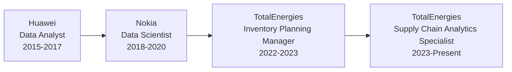

# Ibrahim Fenola | Data Scientist & Supply Chain Analytics Specialist

  

## 👨‍💻 About Me

Data Analytics & Supply Chain Optimization specialist with 8+ years of cross-industry experience leveraging advanced analytics to drive strategic business outcomes. My expertise combines data science fundamentals with practical implementation in complex operational environments.

- 🔭 Currently working as a **Supply Chain Analytics Specialist** at **TotalEnergies**
- 🌱 Specializing in **inventory optimization** and **demand forecasting**
- 🎓 MSc in **Data Science** (Computational Track) from **NJIT**
- 💡 Passionate about transforming raw data into actionable business insights
- 🏆 Reduced forecast errors by 25% and operational costs by 20% through data-driven solutions

## 🛠️ Technical Toolkit

<table>
  <tr>
    <td><strong>Languages & Frameworks</strong></td>
    <td>
      
      
      
    </td>
  </tr>
  <tr>
    <td><strong>Data Science & ML</strong></td>
    <td>
      
      
      
      
    </td>
  </tr>
  <tr>
    <td><strong>BI & Visualization</strong></td>
    <td>
      
      
      
    </td>
  </tr>
  <tr>
    <td><strong>Cloud & Databases</strong></td>
    <td>
      
      
      
    </td>
  </tr>
</table>

## 📊 Areas of Expertise

- **Supply Chain Analytics**: Inventory optimization, demand forecasting, network design, logistics optimization
- **Machine Learning**: Time series forecasting, classification algorithms, supervised learning, deep learning
- **Data Engineering**: ETL pipeline development, data warehouse design, data quality management
- **Business Intelligence**: Dashboard development, KPI design, automated reporting, data storytelling
- **Process Optimization**: Linear programming, constraint-based optimization, simulation modeling

## 🚀 Key Projects & Experience

### Supply Chain Optimization Platform
- **Technologies**: Python, Mixed-Integer Programming, SAP Integration
- **Impact**: Reduced operational costs by 20% through multi-echelon inventory optimization
- **Features**:
  - Custom optimization algorithms for multi-location distribution
  - Real-time data integration with SAP
  - Interactive scenario planning capability
  - Full-stack implementation (backend optimization + frontend visualization)

### ML-Powered Demand Forecasting
- **Technologies**: Python, LSTM, ARIMA, Prophet, PowerBI
- **Impact**: Reduced forecast errors by 25% across warehouses managing $35M inventory
- **Features**:
  - Ensemble approach combining traditional statistical and deep learning models
  - Automated anomaly detection for data quality
  - Dynamic feature engineering based on product hierarchies
  - Integrated with existing planning systems

### Network Optimization at Nokia/Huawei (2015-2020)
- **Technologies**: Statistical modeling, Python, Radio network algorithms
- **Impact**: Improved network capacity by 25% through data-driven optimization
- **Achievements**:
  - Developed custom algorithms for radio network KPI optimization
  - Created automated anomaly detection system identifying issues 24 hours before traditional methods
  - Led cross-functional teams integrating data across multiple systems
  - Produced comprehensive technical documentation and knowledge transfer

## 📝 Selected Publications & Presentations

- **"Multi-Echelon Inventory Optimization in Chemical Supply Chains"** - TotalEnergies Engineering Conference (2023)
- **"Machine Learning Applications in Demand Forecasting"** - NJIT Data Science Symposium (2023)
- **"Network Optimization Techniques for Telecommunications"** - Nokia Technical Review (2019)

## 🎓 Education & Certifications

- **MSc, Data Science (Computational Track)** - New Jersey Institute of Technology (Expected 2024)
- **Diploma, Computer Science** - Nigerian Institute of Computer Science (2008)
- **BSc, Mathematics & Statistics** - University of Lagos (2009)
- **Certified in Data Science & Machine Learning** - NJIT Professional Development

## 🔄 Professional Experience Journey

## 📫 Let's Connect

I'm always interested in collaborating on projects related to data science, supply chain optimization, or machine learning. Feel free to reach out!

- **LinkedIn**: [linkedin.com/in/ibrahimfenola](https://www.linkedin.com/in/ibrahimfenola)
- **Email**: [ibolayinka@gmail.com](mailto:ibolayinka@gmail.com)

---

  

