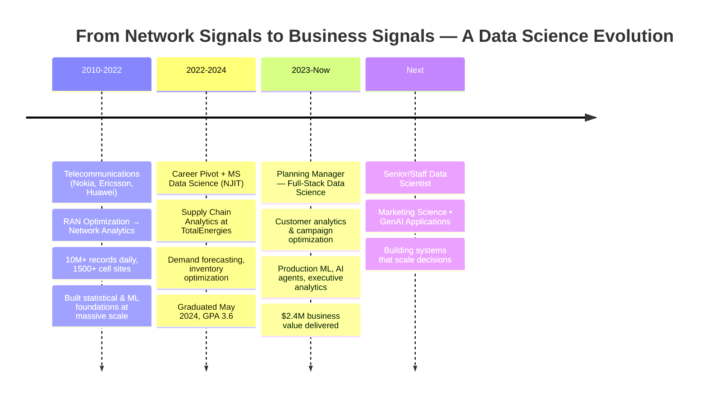

# Ibrahim Fenola
## Data Scientist | ML Engineering • Customer & Marketing Analytics • Supply Chain Optimization • Network Intelligence

<div align="center">

[](https://www.linkedin.com/in/ibrahimfenola)
[](mailto:ibolayinka@gmail.com)
[](https://github.com/fenola)

**Turning Complex Data Into Decisions That Move Revenue, Customers & Operations**

*12+ Years | 3 Industries | $2.4M+ Quantified Business Impact | Production ML Systems*

</div>

---

## 🧭 Career Journey


```mermaid
timeline
    title From Network Signals to Business Signals — A Data Science Evolution
    2010-2022 : Telecommunications (Nokia, Ericsson, Huawei)
              : RAN Optimization → Network Analytics
              : 10M+ records daily, 1500+ cell sites
              : Built statistical & ML foundations at massive scale
    2022-2024 : Career Pivot + MS Data Science (NJIT)
              : Supply Chain Analytics at TotalEnergies
              : Demand forecasting, inventory optimization
              : Graduated May 2024, GPA 3.6
    2023-Now  : Planning Manager — Full-Stack Data Science
              : Customer analytics & campaign optimization
              : Production ML, AI agents, executive analytics
              : $2.4M business value delivered
    Next      : Senior/Staff Data Scientist
              : Marketing Science • GenAI Applications
              : Building systems that scale decisions
```

> **The thread connecting it all:** Every role has been about the same core problem — *extracting signal from noisy, high-volume data and converting it into decisions with measurable financial impact.* The domains changed; the discipline didn't.

---

## 🎯 What I Bring

<table>
<tr>
<td width="33%" valign="top">

### 📊 Marketing & Customer DS
- Propensity modeling & lead scoring (AUC-ROC 0.87)
- Customer segmentation (k-means, hierarchical, RFM)
- A/B testing & experimentation (power analysis, p < 0.05)
- Multi-touch attribution & campaign ROI
- Churn prediction & CLV modeling
- Causal inference (PSM, diff-in-diff)

</td>
<td width="33%" valign="top">

### 📦 Supply Chain Analytics
- Demand forecasting (ARIMA, Prophet, LSTM, XGBoost ensembles)
- Multi-echelon inventory optimization (MIP/LP)
- S&OP / IBP process analytics
- Forecast accuracy: 25% improvement (MAPE 18%→13.5%)
- Network consolidation: $1.1M annual savings
- ABC/XYZ classification at 1,500+ SKU scale

</td>
<td width="33%" valign="top">

### 📡 Network Intelligence
- Large-scale time-series analytics (10M+ records/day)
- Anomaly detection (30% downtime reduction)
- Capacity forecasting & performance modeling
- Multi-vendor RAN optimization (2G→5G)
- Protocol-level data analysis
- Real-time monitoring architecture

</td>
</tr>
</table>

---

## 🛠️ Technical Arsenal

### Core Stack


### Machine Learning & Statistics


### GenAI & LLM Tooling


### Data Engineering & Cloud


### BI, Visualization & Business Systems


---

## 📈 Impact Dashboard

| Metric | Result | Domain |
|--------|--------|--------|
| 💰 Total quantified business value | **$2.4M+** | Cross-functional |
| 📉 Annual cost reduction (network consolidation) | **$1.1M** | Supply Chain |
| 🎯 Campaign response rate improvement | **+25%** (p < 0.05) | Marketing |
| 📊 Forecast accuracy improvement | **MAPE 18% → 13.5%** | Supply Chain |
| 🔮 Propensity model performance | **AUC-ROC 0.87** | Marketing |
| ⚡ Network downtime reduction | **-30%** | Telecom |
| 🤖 Manual analysis time saved via automation | **-40%** | All |
| 📦 Inventory reduction | **$5M** ($13M → $8M) | Supply Chain |
| 🗃️ Largest daily data volume handled | **10M+ records** | Telecom |
| 👥 Customers/SKUs modeled | **1M+ / 1,500+** | Marketing/SC |

---

## 💼 Professional Experience

### **Planning Manager | Data Science & Analytics Lead**
📍 *TotalEnergies Specialties USA* | Nov 2023 – Present

Full-stack data science across customer analytics, demand planning, and operations for a $35M multi-site operation:

**Customer & Marketing Analytics:**
- Built customer segmentation models (k-means with silhouette optimization, hierarchical clustering) on 1M+ records across 25+ behavioral/transactional features → **25% campaign response improvement** (statistically validated, p < 0.05)
- Deployed propensity models (XGBoost, regularized logistic regression) predicting engagement, purchase likelihood, and churn risk → **AUC-ROC 0.87**, enabling precision targeting and spend optimization
- Applied causal inference (propensity score matching, difference-in-differences) to isolate true campaign ROI from baseline noise

**Forecasting & Supply Chain Science:**
- Lead demand planning for 1,500+ SKUs using ensemble forecasting (ARIMA, Prophet, LSTM, XGBoost) → **25% forecast accuracy improvement**
- Drove multi-echelon network optimization (mixed-integer programming) → consolidated 5 warehouses to 2, **$1.1M annual savings**, **$5M inventory reduction**
- Own S&OP KPI accountability: Forecast Accuracy, Bias, OTIF, Daily Sales Conformance — reported monthly to GM & CFO

**AI & Automation Engineering:**
- Built AI agents (LLM integration, Microsoft Copilot) for anomaly detection, forecast validation, and operational intelligence → **40% reduction in manual analysis time**
- Designed automated ETL pipelines (Python, SQL) processing 100K+ daily transactions with data quality validation (99.9% SLA)
- Architected Power BI executive dashboards: 20+ KPIs, 15-minute refresh, drill-down analytics

---

### **Planning Analyst | Analytics & Optimization**
📍 *TotalEnergies Specialties USA* | Aug 2022 – Nov 2023

- Architected $13M enterprise consolidation analysis delivering **$1.1M annual savings**
- Built baseline predictive models (regression family, tree ensembles) with automated forecast error tracking (MAPE 18%)
- Developed RFM segmentation framework for 1M+ customer records
- Created automated ETL reducing manual processing **40%**

---

### **RAN Optimization Engineer → Senior Network Analytics Specialist**
📍 *Nokia | Ericsson | Huawei* | 2010 – 2022

*Progression: Drive Test Engineer → Team Lead → Network Optimization Engineer → Senior RAN Specialist*

12 years building analytics at telecommunications scale across 2G/3G/4G/5G networks:

- Engineered predictive models on **10M+ daily performance records** from **1,500+ cell sites** in multi-vendor environments
- Built anomaly detection identifying network issues **24 hours in advance** → **30% downtime reduction**
- Developed capacity forecasting models with ensemble methods → **MAPE 12%, R² 0.92** on 6-month backtesting
- Implemented full MLOps discipline before it had a name: automated feature engineering (25+ features), hyperparameter tuning, k-fold + time-series cross-validation, drift monitoring, retraining triggers
- Statistical experimentation at scale: designed controlled tests (t-tests, chi-square, 80% power, α=0.05) before rollouts affecting **2M+ end users**

---

## 🚀 Featured Projects

### 🎯 Customer Propensity & Campaign Optimization Engine
**Stack:** Python · XGBoost · scikit-learn · SHAP · Power BI
**Impact:** +25% campaign response · $1.1M annual savings · 40% CAC reduction

End-to-end propensity system: multi-source data integration (CRM, transactions, behavioral), engineered features (RFM scores, purchase velocity, seasonality, price sensitivity), imbalanced classification handling (SMOTE, class weighting), model explainability via SHAP values for stakeholder trust, and expected-ROI-ranked targeting. Validated with chi-square significance testing and 95% confidence intervals.

---

### 📊 Ensemble Demand Forecasting Platform
**Stack:** Python · Prophet · LSTM (TensorFlow) · ARIMA · XGBoost · SAP integration
**Impact:** MAPE 18% → 13.5% · Reduced safety stock requirements · Feeds S&OP cycle

Production forecasting for 1,500+ SKUs with intermittent demand patterns: ADI/CV² demand classification routing SKUs to appropriate models (Croston for intermittent, ensembles for smooth), automated weekly bucket conversion for ERP upload, backtesting framework, and bias monitoring with automatic alerts on systematic over/under-forecasting.

---

### 🔀 Multi-Echelon Network Optimization
**Stack:** Python · scipy.optimize · Mixed-Integer Programming · Scenario simulation
**Impact:** 5 warehouses → 2 · $1.1M annual savings · 15% inventory turnover improvement

Formulated distribution network as MIP: minimize holding + transportation + facility costs subject to demand satisfaction, capacity limits, and 95%+ service level constraints. Ran scenario analysis (2/3/4-warehouse configurations) with demand uncertainty sensitivity testing. Presented trade-off analysis to C-suite for final decision.

---

### 🧪 A/B Testing & Experimentation Framework
**Stack:** Python · SciPy · statsmodels · Plotly
**Impact:** 20+ rigorous experiments monthly · Data-driven campaign decisions

Institutionalized statistical rigor: hypothesis pre-registration, power analysis (80% power, α=0.05), sample size calculation, proper randomization, multiple-testing corrections (Bonferroni), and confidence interval reporting. Killed vanity metrics; institutionalized incremental lift measurement.

---

### 🤖 AI Agent Suite for Operational Intelligence
**Stack:** Python · LLM APIs (OpenAI/Claude) · Microsoft Copilot · Custom orchestration
**Impact:** 40% manual analysis time reduction

Production AI agents: email intelligence (NLP parsing/categorization of operational requests), forecast validation (predicted vs. actual with auto-alerts), KPI anomaly detection, and configuration compliance checking. Practical GenAI — not demos, but deployed tools handling daily operational load.

---

### 📡 Network Anomaly Detection & Capacity Intelligence
**Stack:** Python · TensorFlow · Time-series analysis · Real-time pipelines
**Impact:** 30% downtime reduction · 25% capacity improvement · 2M+ users served

Real-time ingestion of 10M+ daily records, 25+ engineered features (lags, rolling stats, seasonality), ensemble prediction (ARIMA + Prophet + LSTM + XGBoost), achieving MAPE 12% / R² 0.92. Full production lifecycle: automated retraining, drift monitoring, and alerting.

---

## 🧠 How I Work — Modern DS Practice

```python
class DataScientist(Professional):
    """What 'advanced' means to me in 2026 — not just models, but systems."""

    principles = {
        "business_first": "Start from the decision, work backward to the data",
        "statistical_rigor": "p-values, power analysis, CIs — no vanity metrics",
        "production_mindset": "A model in a notebook is a hypothesis, not a product",
        "explainability": "SHAP > black box when stakeholders must act on it",
        "genai_pragmatism": "LLMs as tools in the pipeline, not the whole pipeline",
        "experimentation": "Ship, measure incrementally, kill what doesn't work",
    }

    current_practice = [
        "LLM-augmented analytics workflows (RAG, agents, structured extraction)",
        "MLOps: versioning, monitoring, drift detection, automated retraining",
        "Causal inference over correlation-chasing (PSM, DiD, synthetic control)",
        "Hybrid forecasting: statistical + ML ensembles with demand classification",
        "Decision intelligence: optimization layers on top of predictions",
    ]

    learning_now = [
        "Agentic AI orchestration for enterprise workflows",
        "Marketing mix modeling (Bayesian MMM)",
        "Uplift modeling for treatment-effect targeting",
        "Vector databases & semantic search in production",
    ]
```

---

## 🎓 Education & Credentials

**MS, Data Science** (Computational Track) — *New Jersey Institute of Technology* | GPA 3.6 | May 2024
> Machine Learning · Deep Learning · Causal Inference · Experimental Design · Big Data Systems · Time Series

**BS, Mathematics & Statistics** — *University of Lagos* | 2009

**Certifications:** ISO 14001:2015 Internal Auditor · Network Security Fundamentals · NJIT Data Science Specialization

**In Progress:** AWS ML Specialty · Advanced Bayesian Methods

---

## 🗺️ Domain × Skill Matrix

| Capability | Marketing/Customer | Supply Chain | Telecom/Network |
|---|:---:|:---:|:---:|
| Predictive Modeling | ✅ Propensity, churn, CLV | ✅ Demand, safety stock | ✅ Capacity, failures |
| Time Series Forecasting | ✅ Campaign demand | ✅✅ Core expertise | ✅✅ Core expertise |
| Optimization (LP/MIP) | ✅ Budget allocation | ✅✅ Network design | ✅ Resource allocation |
| Experimentation/Causal | ✅✅ A/B, PSM, DiD | ✅ Policy evaluation | ✅ Rollout testing |
| Anomaly Detection | ✅ Campaign metrics | ✅ Demand signals | ✅✅ Real-time systems |
| Segmentation/Clustering | ✅✅ Customer segments | ✅ ABC/XYZ SKUs | ✅ Site profiling |
| GenAI/LLM Applications | ✅ Content & scoring | ✅ Ops automation | ✅ Log intelligence |
| Executive Communication | ✅✅ C-suite reporting | ✅✅ S&OP leadership | ✅ Ops reviews |

*✅✅ = deep production experience · ✅ = hands-on applied experience*

---

## 📊 GitHub Activity

<div align="center">


</div>

---

## 🤝 Open To

**Roles:** Senior/Staff Data Scientist · Marketing Data Scientist · ML Engineer · Analytics Manager · Supply Chain Data Scientist · Decision Science roles

**Conversations about:** Propensity & uplift modeling · Forecasting at scale · Causal inference in business · GenAI in production workflows · Career pivots into DS

<div align="center">

[](https://www.linkedin.com/in/ibrahimfenola)
[](mailto:ibolayinka@gmail.com)

---

**"The domains change. The discipline doesn't: signal from noise, decisions from signal, value from decisions."**


</div>
